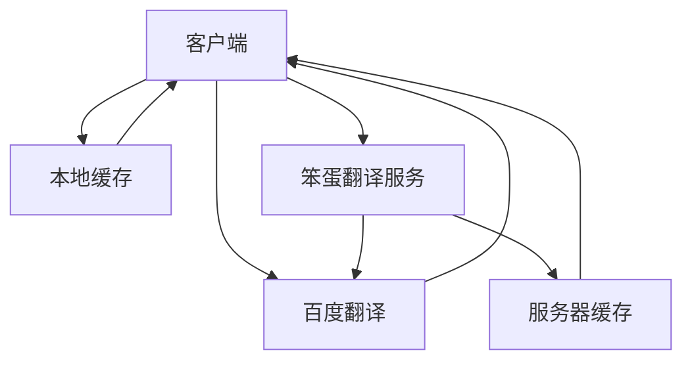

## 笨蛋笔记
- 项目适用者：英文太菜，词汇量不够，又耻于用拼音的开发者
- 安装 
    * `npm install bdnote -g`
- 使用
    * `bdnote --help`   查看帮助手册
    * `bdnote --word=笨蛋` 默认汉译英
        *** 
           笨蛋<----->Idiot 
        ***
    * `bdnote --clean`  清除本地缓存
 
- 查询过程
    * `1. 查询本地缓存，有即返回`
    * `2. 选择查询方式，直接请求百度翻译或访问服务器`
    * `3. 服务器查询，首先查看服务器缓存，有即返回，否则请求百度翻译，并更新各级缓存`
    * `4. 直接请求百度翻译，更新各级缓存`

